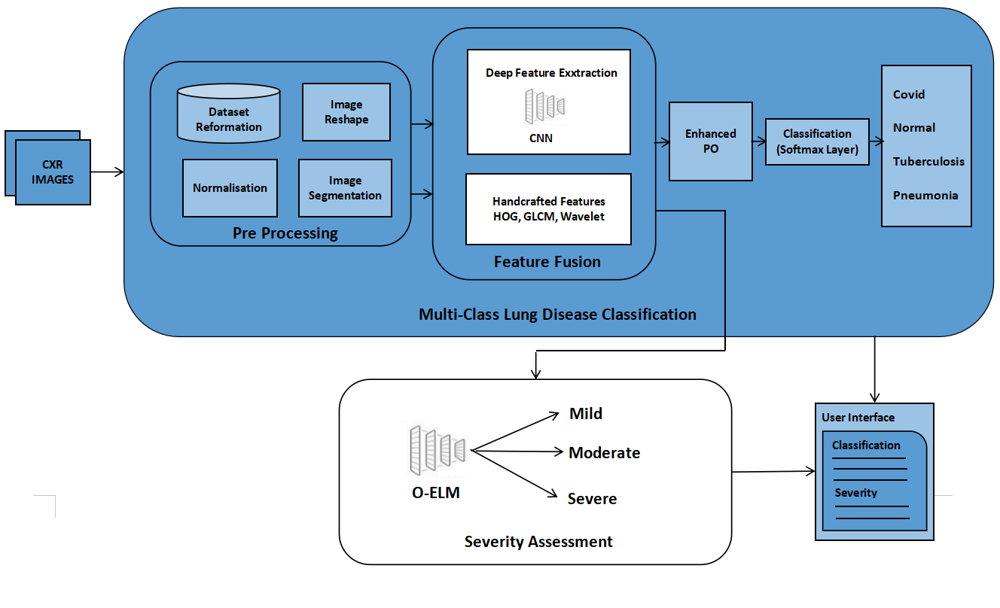
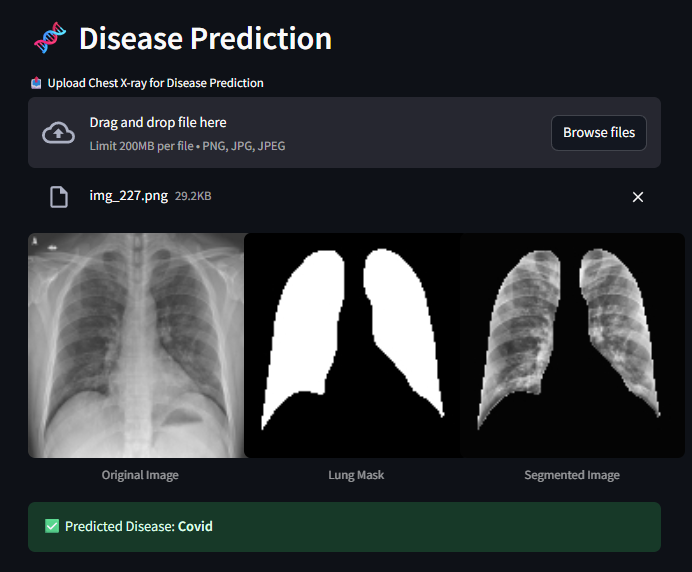
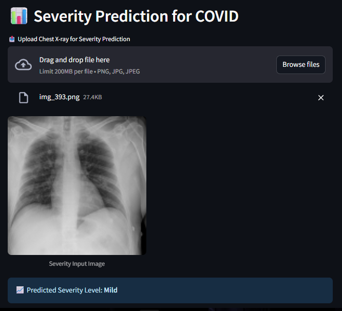

# 🏥 Optimized Deep Learning Framework for Multi-Class Lung Disease Diagnosis and Severity Assessment

An advanced deep learning framework designed for accurate multi-class lung disease diagnosis and severity assessment using Chest X-ray (CXR) images. This project integrates optimized CNNs, feature fusion, and machine learning to deliver high-performance results for clinical applications.

---

## 🌐Deployed App

[➡️ ]([https://atheeq2003-movie-recommender.streamlit.app/](https://atheeq2003-disease-classification-severity-assessment.streamlit.app/))**[Explore the Deployed App Here]([https://atheeq2003-movie-recommender.streamlit.app/](https://atheeq2003-disease-classification-severity-assessment.streamlit.app/))**

---

## 🌟 Key Features

- **Multi-Class Lung Disease Diagnosis**: Classifies CXR images into **COVID-19, Tuberculosis, Viral Pneumonia, and Normal** cases.
- **Severity Assessment**: Evaluates disease severity as **Mild, Moderate, or Severe** using an Optimized Extreme Learning Machine (O-ELM).
- **Interactive Web UI**: Built with Streamlit for easy deployment and user interaction.
- **Hybrid Feature Fusion**: Combines **deep features (EfficientNetV2-L)** with **handcrafted features (GLCM, HOG, Wavelet)** for robust performance.
- **Optimized Training**: Enhanced with **Parrot Optimizer (PO)** and **Imperialist Competitive Algorithm (ICA)** for efficient model convergence.
- **High Accuracy**: Achieves **90.58% classification accuracy** and **80.67% severity assessment accuracy**.

---

## 🛠️ System Architecture

1. **Data Preprocessing**: Normalization, resizing, and lung segmentation using **MultiRes U-Net**.
2. **Feature Extraction**: Deep features from **EfficientNetV2-L** + handcrafted features (GLCM, HOG).
3. **Feature Fusion**: Combines features for a unified representation.
4. **Classification**: **Softmax classifier** for disease prediction.
5. **Severity Assessment**: **O-ELM** for grading disease severity.

---

## 🖥️ Streamlit Web Application

The framework includes an interactive web interface built with Streamlit that allows users to:

1. Upload chest X-ray images
2. View lung segmentation results
3. Get disease predictions
4. Receive severity assessments (for COVID-19 cases)

   

   

---

### UI Features:

- Real-time image processing
- Visual segmentation results
- Clear prediction outputs
- Responsive design

---

## 📊 Performance Highlights

| Metric                    | Score       |
| ------------------------- | ----------- |
| Disease Classification    | 90.58%      |
| Severity Assessment       | 80.67%      |
| F1-Score (Disease)        | 90.20%      |
| Mean Absolute Error (MAE) | 0.08        |
| Inference Time            | ~130 ms/img |
